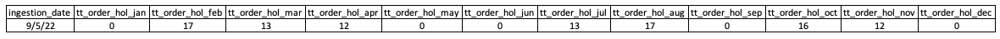

# Data-Engineering-Capstone-Project-for-Norby-Inc

## Overview

Norby Inc is a multinational company that deals in household items. The business stakeholders requires the service of Data Engineering team to create a robust **ELT Pipeline** for Norby Inc. and to provide the company with some required analysis. 

The goal was to gather and analyse data related to orders, reviews, and shipments to help Norby Inc. make informed decisions.

## The Technical Details

#### Data Modelling

The attached ER table has been provided. It shows the relationship between the table.
The Order table is the fact table.The product table,dim_customer table,calender date table,review table and shipment table are all connected to the fact table.

This is a Star schema.

#### Libraries
We used several tools to accomplish our tasks, 
including pandas (a data manipulation library), io (for handling input and output streams), sqlalchemy (for database connection), time (for time-related operations), and boto3 (to interact with Amazon S3, where data was stored).

#### Data Lake Connection
Our first step was connecting to a data lake hosted on Amazon S3 containing three (3) fact tables:
 - Order
 - Review
 - Shipments

Data lake is like a giant storage bucket in the cloud. In this bucket, Norby Inc. had stored data in the form of CSV files. Think of CSV files as spreadsheets with rows and columns. We used a Python library called boto3 to access and retrieve these files from the S3 bucket.
Once we had the data, we loaded it into Pandas DataFrames. Think of DataFrames as virtual spreadsheets that can be manipulated using code.

#### Data Warehouse Connection
To centralize and organize the data for analysis, we connected to a data warehouse. Think of a data warehouse as a big, well-organized database. We used SQLAlchemy, which is like a bridge between Python code and the database. To connect, we provided credentials like a username, password, and details about where the database is located.

#### Data Loading
With the connection in place, we loaded the data from our Pandas DataFrames into the data warehouse. Think of this step as moving information from spreadsheets into a massive digital filing cabinet. We also specified exactly where in the filing cabinet (schema) the data should be stored.

## Tasks
Our main job was to answer specific questions using the data. Here is what we found:

#### Requirement 1: Total Number of Orders Placed on Public Holidays Every Month
We created SQL queries (special code for databases) to count how many orders were made on public holidays each month over the past year. This helps Norby Inc. understand customer behavior during holidays.

#### Requirement 2: Total Number of Late Shipments and Undelivered Shipments
Using more SQL queries, we figured out how many shipments were late (took too long to arrive) and how many shipments never arrived at all. This is crucial for measuring the quality of Norby Inc.'s delivery service.
#### Requirement 3: Analysis of Best Performing Product
We went even further by analysing which product was the best performer. We considered how many points it got in customer reviews, the day it was ordered the most, and whether that day happened to be a public holiday. We also calculated the percentages of different review scores and the percentages of shipments that were early or late for this product.

## Conclusion
In the end, we successfully completed the Data Engineering Capstone Project for Norby Inc. This project involved technical tasks like extracting data from a cloud storage bucket, connecting to a database, and writing complex queries. But it was all done to help Norby Inc. understand their business better, especially when it comes to customer behaviour, shipment quality, and product performance. The insights gained from this project can guide Norby Inc. in making smarter decisions for their future.

## Project Team Members
•	Arowolo Oluseyi Victor
•	Boniface Chijioke
•	Oluwatosin Abigeal Oshuntolu
•	Taiwo Adegbayi
•	Michael Oseyemi

