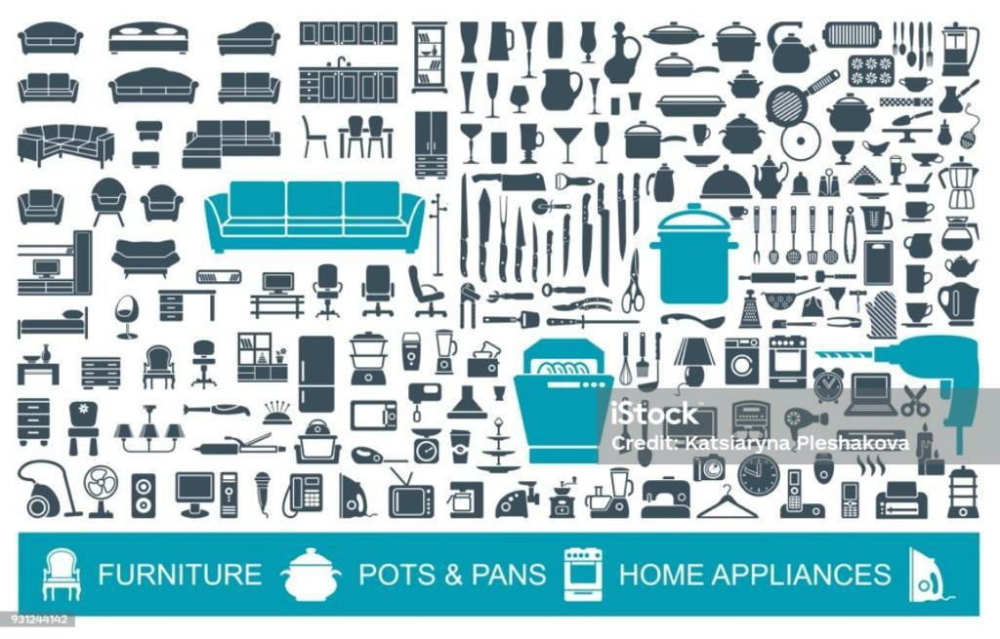
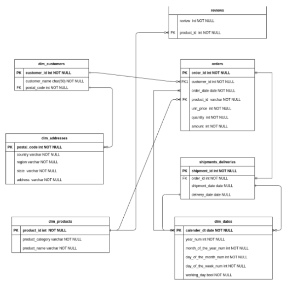
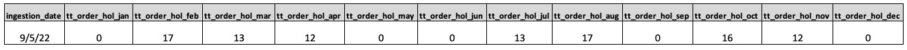
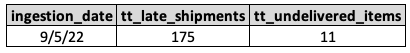
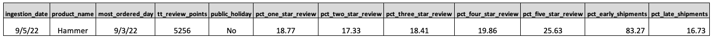

# Data-Engineering-Capstone-Project-for-Norby-Inc

## Overview
Norby Inc is a multinational company that deals in house-hold items. 

The purpose of this project is to integrate data from different sources to build an ELT pipeline against which some analyses are run to support strategic decision making. 

## Problem Statement
Norby Inc. will like to know the following:

-	The total number of orders placed on a public holiday every month, for the past year.
-	Total number of late shipments.
-	Total number of undelivered shipments.
-	The product with the highest reviews, the day it was ordered the most, either that day was a public holiday, total review points, percentage distribution of the review points, and percentage distribution of early shipments to late shipments for that particular product.

**_Glossary:_**

_1.	A public holiday is a day with a day_of_the_week number in the range of 1 - 5 and a working_day value of false._

_2.	A late shipment is one with shipment_date greater than or equal to 6 days after the 
order_date and delivery_date is NULL._

_3.	An undelivered shipment is one with delivery_date as NULL and shipment_date as NULL and the current_date 15 days after order_date._

## Data Source
Amongst the data sources were fact tables from data lake which is an Amazon S3 Bucket.
**Bucket Name:** 10alytics-capstone-bucket
**Data Locations:** s3://10alytics-capstone-bucket/orders_data/* 

This directory contains the following files:
- orders.csv: This data is a fact table about orders gotten on our website Norby Inc. 
- reviews.csv: This data is a fact table on reviews given for a particular delivered product 
- shipments_deliveries.csv: This is a fact table on shipments and their delivery dates

The Dimension data were already loaded into the Datawarehouse which is a postgres database. These are listed below:
- dim_customers
- dim_addresses
- dim_products
- dim_dates

The dim_* tables are loaded into the if_common schema. For example, I can access the dim_customers table with if_common.dim_customers.

## Data Modelling
Below is the Entity Relationship Diagram (ERD) showing the data model of our datawarehouse.

The attached ER table has been provided. It shows the relationship between the different tables.

## Tools & Techniques
- Jupyter notebook (Python)
- Amazon s3 Bucket
- PostgresSQL
- SQLAlchemy
- Boto3 Library
- Data Transformation using Advance level SQL queries (Subquery, CTE etc)
- Data Modelling
- Data Pipeline

## Results
Our main job was to answer specific questions using the data. Here is what we found:

#### Requirement 1: Total Number of Orders Placed on Public Holidays Every Month
We created SQL queries (special code for databases) to count how many orders were made on public holidays each month over the past year. This helps Norby Inc. understand customer behavior during holidays.

#### Requirement 2: Total Number of Late Shipments and Undelivered Shipments
Using more SQL queries, we figured out how many shipments were late (took too long to arrive) and how many shipments never arrived at all. This is crucial for measuring the quality of Norby Inc.'s delivery service.

#### Requirement 3: Analysis of Best Performing Product
We went even further by analysing for the best performing product. We considered how many points it got in customer reviews, the day it was ordered the most, and whether that day happened to be a public holiday or not. We also calculated the percentages of different review scores and the percentages of shipments that were early or late for this product.

## Conclusion
In the end, we successfully completed the Data Engineering Capstone Project for Norby Inc. This project involved technical tasks like extracting data from a cloud storage bucket, connecting to a database, and writing complex queries. But it was all done to help Norby Inc. understand their business better, especially when it comes to customer behaviour, shipment quality, and product performance. The insights gained from this project can guide Norby Inc. in making smarter decisions for their future.
